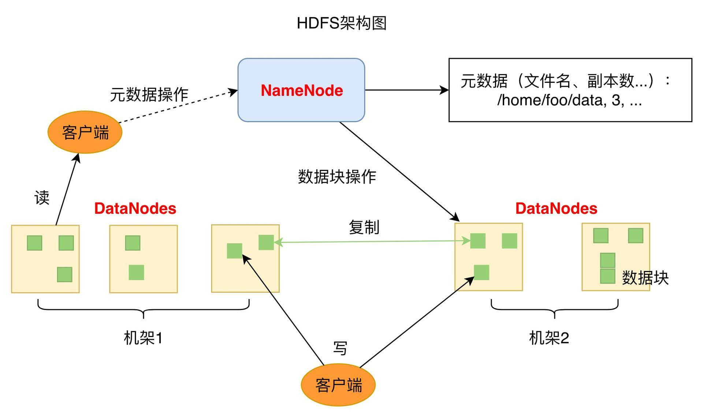

我们再回过头看下 Linux 的文件系统：文件的基本信息，也就是文件元信息记录在文件控制块 inode 中，文件的数据记录在硬盘的数据块中，inode 通过索引记录数据块的地址，读写文件的时候，查询 inode 中的索引记录得到数据块的硬盘地址，然后访问数据。

如果将数据块的地址改成分布式服务器的地址呢？也就是查询得到的数据块地址不只是本机的硬盘地址，还可以是其他服务器的地址，那么文件的存储容量就将是整个分布式服务器集群的硬盘容量，这样还可以在不同的服务器上同时并行读取文件的数据块，文件访问速度也将极大的加快。

