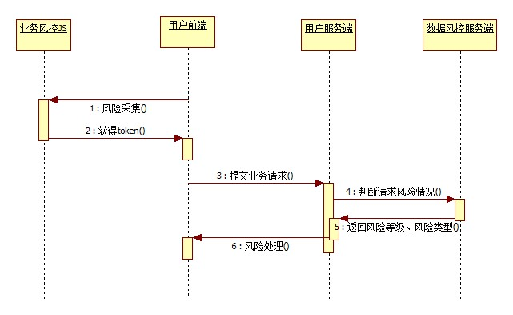

## 目的

1. 对抗高频的暴力破解

## 类型

1. 传统验证码：字符验证码
   破解：OCR(光学字符识别)
2. 拼图验证码
   从图库拉取一张图片，随机在图片抠取一张小拼图块。服务器生成时会记录小接图块的位置。用户在将小拼图块拖动到目标位置时，提交座标给服务器进行答案校验。
   破解：计算出偏移值
3. 滑块验证码
   滑动验证码并不是验证码，它只是一种网页数据加密的方式，其原理是：采集用户的操作数据，环境数据等等，非常多的数据，通过一个算法加密得到字符串，然后提交到服务器分析，服务器有一个判定标准，对数据进行简单的分析就知道是不是人工在操作。
4. 图中点选
5. 智能验证码

## 相关产品

- [极验](http://www.geetest.com/demo/)
- [腾讯验证码](https://007.qq.com/captcha/#/)

费用问题：

**腾讯：https://buy.cloud.tencent.com/price/yy**

| 每日防护上限 | 包月价格（包年价格=包月价格*10） |
| ------------ | -------------------------------- |
| 2万次        | 1200元                           |
| 4万次        | 1800元                           |
| 10万次       | 3000元                           |
| 20万次       | 5000元                           |
| 60万次       | 12000元                          |

**极验：**

免费版：
限制：500次/h 有广告

**顶象：**
免费版：无后台
企业版：//todo
备注：前阿里员工陈树华创建

## Demo

- [腾讯](http://localhost/code.php)
- [顶象](http://localhost/dingxiang/)
- [滑块验证码](http://www.duote.com/Login/login)

## 自行搭建

流程图

1. 后端随机生成抠图和带有抠图阴影的背景图片，后台保存随机抠图位置坐标
   需要按照GD库扩展
2. 前端实现滑动交互，将抠图拼在抠图阴影之上，获取到用户滑动距离值
3. 前端将用户滑动距离值传入后端，后端校验误差是否在容许范围内。

## 优缺点

#### 第三方
优点：

1. 相关配套后台
2. 二次验证
3. 搭建成本低

缺点：

1. 付费问题
2. LOGO问题

#### 自行搭建
优点：

1. LOGO自定义

缺点：

1. 维护的成本
2. 相关配套后台：数据统计，设置：验证码语言问题
3. 缺少二次验证，可靠性低

## 参考资料

- [极验验证码破解](https://github.com/FanhuaandLuomu/geetest_break)
- [腾讯验证码的十二年](https://zhuanlan.zhihu.com/p/23563375)
- [滑块验证码（滑动验证码）相比图形验证码，破解难度如何？](https://www.zhihu.com/question/32209043)
- [滑动验证码的实现原理](https://www.xttblog.com/?p=1126)

## 相关开源项目

- [clicaptcha](https://github.com/hooray/clicaptcha)