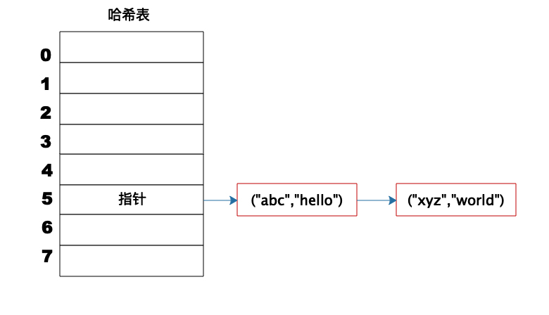
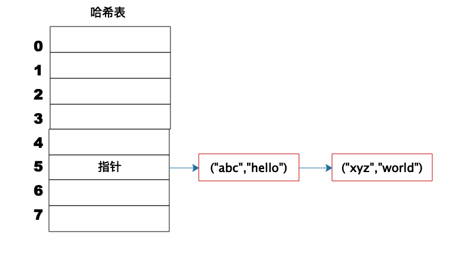

上图这个例子中，Key 是字符串 abc，Value 是字符串 hello。我们先计算 Key 的哈希值，得到 101 这样一个整型值。然后用 101 对 8 取模，这个 8 是哈希表数组的长度。101 对 8 取模余 5，这个 5 就是数组的下标，这样就可以把 (“abc”,“hello”) 这样一个 Key、Value 值存储在下标为 5 的数组记录中。

当我们要读取数据的时候，只要给定 Key abc，还是用这样一个算法过程，先求取它的 HashCode 101，然后再对 8 取模，因为数组的长度不变，对 8 取模以后依然是余 5，那么我们到数组下标中去找 5 的这个位置，就可以找到前面存储进去的 abc 对应的 Value 值。

但是如果不同的 Key 计算出来的数组下标相同怎么办？HashCode101 对 8 取模余数是 5，HashCode109 对 8 取模余数还是 5，也就是说，不同的 Key 有可能计算得到相同的数组下标，这就是所谓的 Hash 冲突，解决 Hash 冲突常用的方法是链表法。

事实上，(“abc”,“hello”) 这样的 Key、Value 数据并不会直接存储在 Hash 表的数组中，因为数组要求存储固定数据类型，主要目的是每个数组元素中要存放固定长度的数据。所以，数组中存储的是 Key、Value 数据元素的地址指针。一旦发生 Hash 冲突，只需要将相同下标，不同 Key 的数据元素添加到这个链表就可以了。查找的时候再遍历这个链表，匹配正确的 Key。

因为有 Hash 冲突的存在，所以“Hash 表的时间复杂度为什么是 O(1)？”这句话并不严谨，极端情况下，如果所有 Key 的数组下标都冲突，那么 Hash 表就退化为一条链表，查询的时间复杂度是 O(N)。