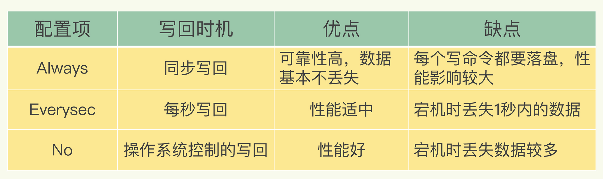

### Redis如何做持久化的？

1. bgsave做镜像全量持久化，aof做增量持久化。因为bgsave会耗费较长时间，不够实时，在停机的时候会导致大量丢失数据，所以需要aof来配合使用。
2. bgsave:在后台异步(Asynchronously)保存当前数据库的数据到磁盘。
3. AOF: 以协议文本的方式，将所有对数据库进行过写入的命令（及其参数）记录到 AOF 文件，以此达到记录数据库状态的目的。

## AOF

#### 优点

命令执行后才记录日志，不会阻塞当前的写操作

#### 问题

刚执行玩之后，没有记成功就宕机了，会丢失数据

AOF可能会阻塞下一次操作

## 写回策略

