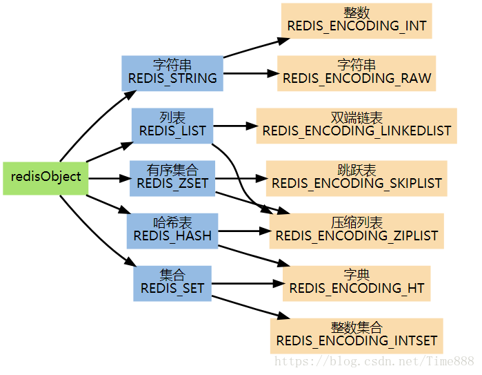
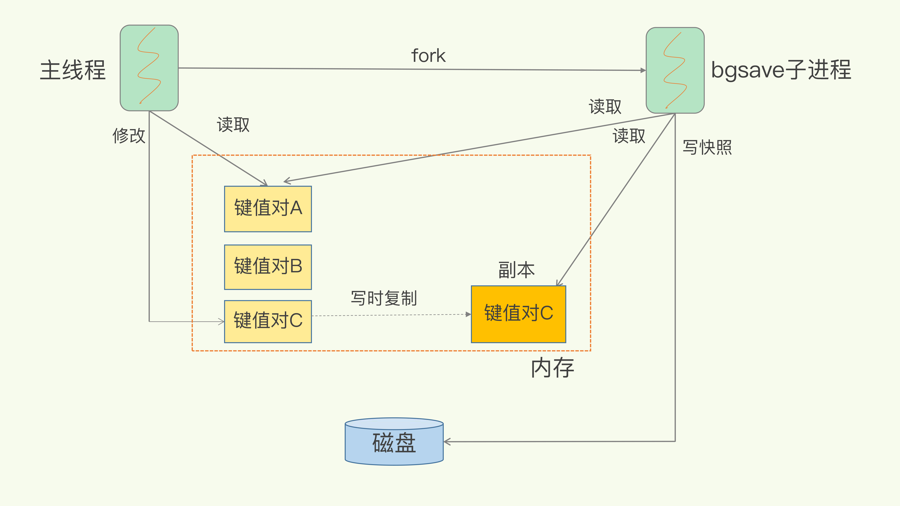
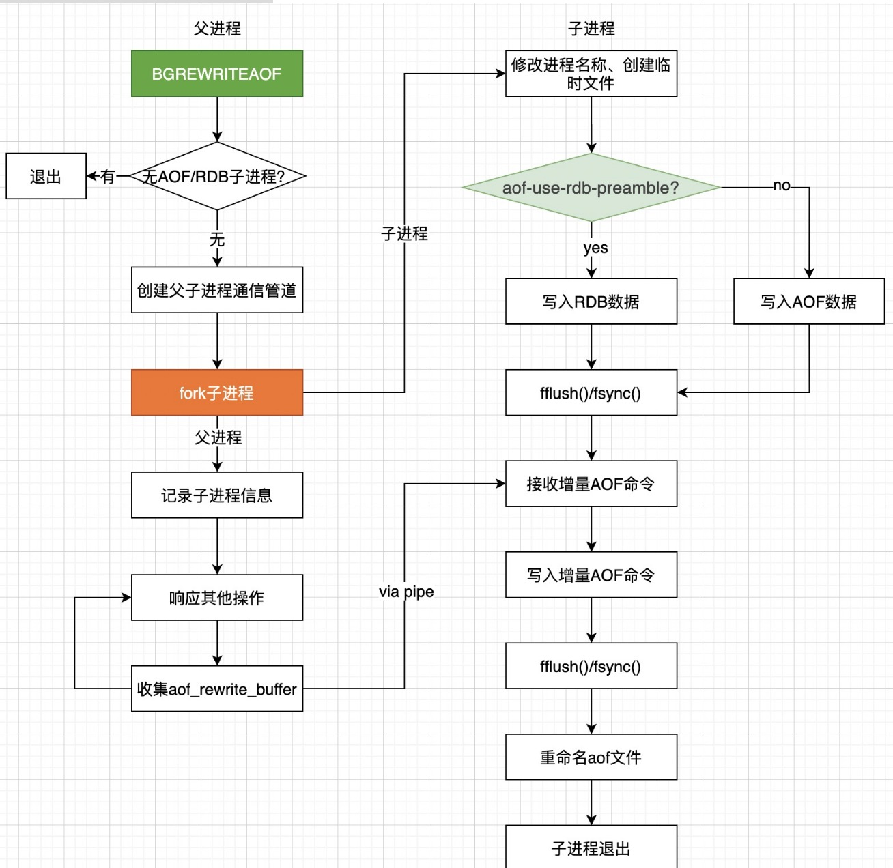

#### 为什么要使用Nosql

- 易扩展   
  这些类型的数据存储不需要固定的模式，无需多余的操作就可以进行横向的扩展。相对于关系型数据库可以减少表和字段特别多的情况。也无型之间在架构的层面上带来了可扩展的能力 
- 大数据量提高性能 
- 多样灵活的数据模型 


#### Redis 为什么使用单进程单线程方式也这么快

- 完全基于内存，绝大部分请求是纯粹的内存操作，非常快速。数据存在内存中，类似于HashMap，HashMap的优势就是查找和操作的时间复杂度都是O(1)；
- 数据结构简单，对数据操作也简单，Redis中的数据结构是专门进行设计的；
- 采用单线程，避免了不必要的上下文切换和竞争条件，也不存在多进程或者多线程导致的切换而消耗 CPU，不用去考虑各种锁的问题，不存在加锁释放锁操作，没有因为可能出现死锁而导致的性能消耗；
- 使用多路 I/O 复用模型；  
  多路I/O复用模型是利用 select、poll、epoll 可以同时监察多个流的 I/O 事件的能力，在空闲的时候，会把当前线程阻塞掉，当有一个或多个流有 I/O 事件时，就从阻塞态中唤醒，于是程序就会轮询一遍所有的流（epoll 是只轮询那些真正发出了事件的流），并且只依次顺序的处理就绪的流，这种做法就避免了大量的无用操作。
  
  参考资料：http://www.syyong.com/db/Redis-why-the-use-of-single-process-and-single-threaded-way-so-fast.html


### redis有哪些危险的命令？怎么避免?

keys

Flushdb

flushall

重命名/禁用命令


### 过期机制

#### 惰性删除

在取出该键的时候对键进行过期检查，即只对当前处理的键做删除操作，不会在其他过期键上花费 CPU 时间

#### 定期删除

定期策略是每隔一段时间执行一次删除过期键的操作，并通过限制删除操作执行的时长和频率来减少删除操作对CPU 时间的影响，同时也减少了内存浪费

1. 

## Redis的过期策略

我们都知道，Redis是key-value数据库，我们可以设置Redis中缓存的key的过期时间。Redis的过期策略就是指当Redis中缓存的key过期了，Redis如何处理。

过期策略通常有以下三种：

- 定时过期：每个设置过期时间的key都需要创建一个定时器，到过期时间就会立即清除。该策略可以立即清除过期的数据，对内存很友好；但是会占用大量的CPU资源去处理过期的数据，从而影响缓存的响应时间和吞吐量。
- 惰性过期：只有当访问一个key时，才会判断该key是否已过期，过期则清除。该策略可以最大化地节省CPU资源，却对内存非常不友好。极端情况可能出现大量的过期key没有再次被访问，从而不会被清除，占用大量内存。
- 定期过期：每隔一定的时间，会扫描一定数量的数据库的expires字典中一定数量的key，并清除其中已过期的key。该策略是前两者的一个折中方案。通过调整定时扫描的时间间隔和每次扫描的限定耗时，可以在不同情况下使得CPU和内存资源达到最优的平衡效果。
  (expires字典会保存所有设置了过期时间的key的过期时间数据，其中，key是指向键空间中的某个键的指针，value是该键的毫秒精度的UNIX时间戳表示的过期时间。键空间是指该Redis集群中保存的所有键。)

Redis 默认会每秒进行 10 次（redis.conf 中通过 hz 配置）过期扫描，扫描并不是遍历过期字典中的所有键，而是采用了如下方法

1. 从过期字典中随机取出 20 个键

2. 删除这 20 个键中过期的键

3. 如果过期键的比例超过 25% ，重复步骤 1 和 2

   

Redis中同时使用了惰性过期和定期过期两种过期策略。


## Redis缓存置换策略

FIFO（first in first out）

•淘汰最早的数据

LRU（least recently used）

•淘汰最长时间未被使用的数据

LFU（east frequently used）

•淘汰使用次数最少的数据


### Redis缓存数据类型的选择?  

1. Strings 数据结构是简单的key-value类型，value其实不仅是String，也可以是数字.  
2. Hash:序列化数据，key-value快速查找，官方建议能用hash就用hash
   在Memcached中，我们经常将一些结构化的信息打包成HashMap，在客户端序列化后存储为一个字符串的值，比如用户的昵称、年龄、性别、积分等，这时候在需要修改其中某一项时，通常需要将所有值取出反序列化后，修改某一项的值，再序列化存储回去。这样不仅增大了开销，也不适用于一些可能并发操作的场合（比如两个并发的操作都需要修改积分）。而Redis的Hash结构可以使你像在数据库中Update一个属性一样只修改某一项属性值。
3. Lists：双向链表/消息队列
4. Set: 类似Lists，可做去重




### Redis底层实现

#### hash

Redis中的字典采用哈希表作为底层实现，一个哈希表有多个节点，每个节点保存一个键值对。


### 监控指标

1、QPS (每秒查询量)

2、连接数

3、连接数使用率

4、CPU使用情况

5、内存使用情况

6、碎片率

7、阻塞连接数

###### 工具

https://prometheus.io/


### 数据同步

rdb文件、增量


## Redis写入大量数据后，为什么变慢了？

Redis是基于哈希表实现的

可能是哈希表的冲突问题和rehash可能带来的操作阻塞。


### Redis Cluster请求重定向

在集群模式下，Redis接收任何键相关命令时首先计算键对应的槽，再根据槽找出所对应的节点，如果节点是自身，则处理键命令；否则回复MOVED重定向错误，通知客户端请求正确的节点。这个过程称为MOVED重定向。


## Redis主从切换

新服务器执行：SLAVEOF NO ONE

redis从属服务器执行命令 SLAVEOF NO ONE 将使得这个从属服务器关闭复制功能，并从从属服务器转变回主服务器，原来同步所得的数据集不会被丢弃。


## Redis问题处理

#### 应对缓存穿透

缓存穿透，即黑客故意去请求缓存中不存在的数据，导致所有的请求都怼到数据库上，从而数据库连接异常。

解决方案：

利用互斥锁，缓存失效的时候，先去获得锁，得到锁了，再去请求数据库，没得到锁，则休眠一段时间重试；

1、采用异步更新策略，无论Key是否取到值，都直接返回。Value值中维护一个缓存失效时间，缓存如果过期，异步起一个线程去读数据库，更新缓存，需要做缓存预热（项目启动前，先加载缓存）操作；

2、提供一个能迅速判断请求是否有效的拦截机制，比如利用布隆过滤器，内部维护一系列合法有效的Key，迅速判断出，请求所携带的Key是否合法有效，如果不合法，则直接返回。

#### 应对缓存雪崩

缓存雪崩，即缓存同一时间大面积的失效，这个时候又来了一波请求，结果请求都怼到数据库上，从而导致数据库连接异常。

解决方案：

1、给缓存的失效时间加上一个随机值，避免集体失效；

2、使用互斥锁，但是该方案吞吐量明显下降了；

3、双缓存。我们有两个缓存，缓存A和缓存B。缓存A的失效时间为20分钟，缓存B不设失效时间，自己做缓存预热操作。

然后细分以下几个小点：

a. 从缓存A读数据库，有则直接返回；

b. A 没有数据，直接从B读数据，直接返回，并且异步启动一个更新线程；

c. 更新线程同时更新缓存A和缓存B。


## 应用

查看帖子分页

```
ZRANGE salary 0 -1 WITHSCORES        # 递增排列
ZREVRANGE salary 0 -1 WITHSCORES     # 递减排列
```


## 集群复制

##### 2.8 版以前，Redis 通过同步(sync)和指令传播(command propagate)两个操作完成同步

同步(sync)：将从节点的数据库状态更新至与主节点的数据库状态一致
指令传播(command propagate)：主节点数据被修改，会主动向从节点发送执行的写指令，从节点执行之后，两个节点数据状态又保持一致

##### 2.8 版开始新增 PSYNC 指令，PSYNC 具有两种模式：

完整重同步(full resynchronization)，与 SYNC 过程基本一致
部分重同步(partial resynchronization)，借助复制偏移量、复制积压缓冲区、服务器运行 ID ，完成主从节点断开连接后，从节点重连主节点后，条件允许，主节点将连接断开期间执行的写指令发送给从节点，从节点接收并执行写指令，将数据库更新至主节点当前状态


### Redis如何做持久化的？

bgsave做镜像全量持久化，aof做增量持久化。因为bgsave会耗费较长时间，不够实时，在停机的时候会导致大量丢失数据，所以需要aof来配合使用。

内存快照以一定的频率执行，在两次快照之间，使用 AOF 日志记录这期间的所有命令操作

#### RDB快照：全量

1. Save: 在主线程中执行，会导致阻塞
2. bgsave:在后台异步(Asynchronously)保存当前数据库的数据到磁盘。



#### AOF（Append Only File：增量

#### 概念

AOF: 以协议文本的方式，将所有对数据库进行过写入的命令（及其参数）记录到 AOF 文件，以此达到记录数据库状态的目的。

#### 优点

命令执行后才记录日志，不会阻塞当前的写操作

#### 问题

刚执行玩之后，没有记成功就宕机了，会丢失数据

AOF可能会阻塞下一次操作

#### 写回策略


### Redis的同步机制了解么？

Redis可以使用主从同步，从从同步。第一次同步时，主节点做一次bgsave，并同时将后续修改操作记录到内存buffer，待完成后将rdb文件全量同步到复制节点，复制节点接受完成后将rdb镜像加载到内存。加载完成后，再通知主节点将期间修改的操作记录同步到复制节点进行重放就完成了同步过程。



## 底层

[Redis 字典遍历](https://juejin.im/post/5b73aaec518825612d644a12)


## 其他小问题

1、Redis最多支持多少key?

2^32，最少2.5亿


2、假如Redis里面有1亿个key，其中有10w个key是以某个固定的已知的前缀开头的，如果将它们全部找出来？

使用keys指令可以扫出指定模式的key列表。
可能的问题：keys指令会导致线程阻塞一段时间，这个时候可以使用scan指令，scan指令可以无阻塞的提取出指定模式的key列表，但是会有一定的重复概率，在客户端做一次去重就可以了，但是整体所花费的时间会比直接用keys指令长。