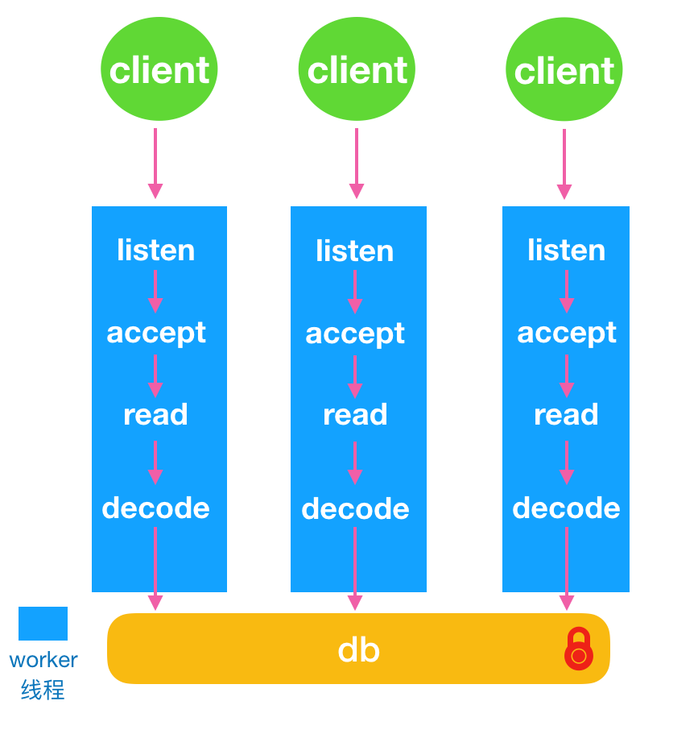
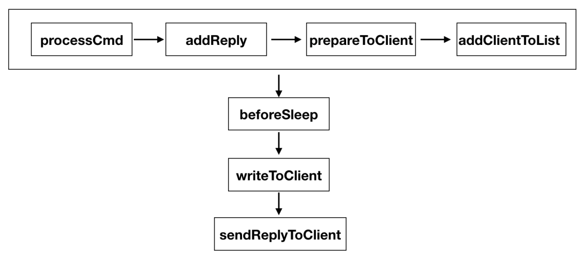
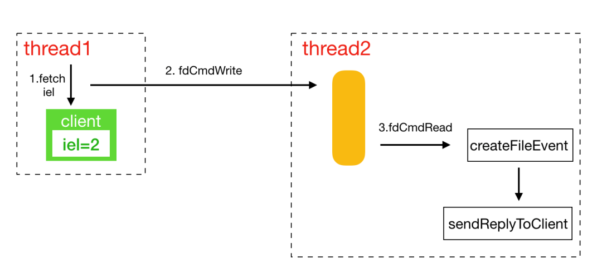
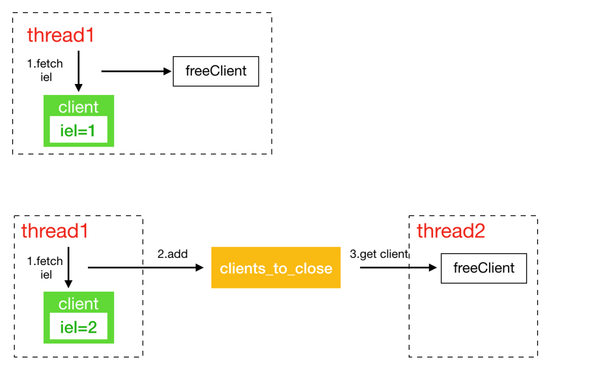
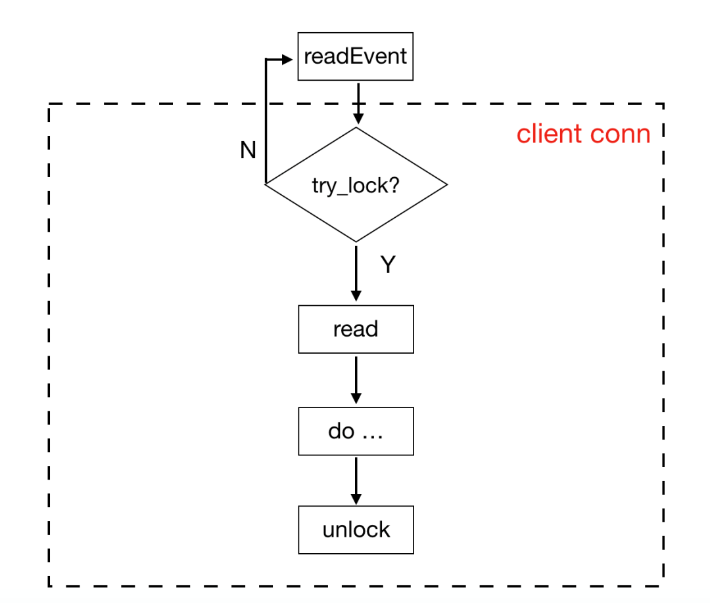

## 一、线程模型

KeyDB将Redis原来的主线程拆分成了主线程和worker线程。每个worker线程都是io线程，负责监听端口，accept请求，读取数据和解析协议。如图所示：



KeyDB使用了SOREUSEPORT特性，多个线程可以绑定监听同个端口。每个worker线程做了cpu绑核，读取数据也使用了SOINCOMING_CPU特性，指定cpu接收数据。解析协议之后每个线程都会去操作内存中的数据，由一把全局锁来控制多线程访问内存数据。主线程其实也是一个worker线程，包括了worker线程的工作内容，同时也包括只有主线程才可以完成的工作内容。在worker线程数组中下标为0的就是主线程。主线程的主要工作在实现serverCron，包括：

**1、**处理统计

**2、**客户端链接管理

**3、**db数据的resize和reshard

**4、**处理aof

**5、**replication主备同步

**6、**cluster模式下的任务

## 二、链接管理

在Redis中所有链接管理都是在一个线程中完成的。在KeyDB的设计中，每个worker线程负责一组链接，所有的链接插入到本线程的链接列表中维护。链接的产生、工作、销毁必须在同个线程中。每个链接新增一个字段 `intiel;/* the event loop index we're registered with */`用来表示链接属于哪个线程接管。KeyDB维护了三个关键的数据结构做链接管理：

**1、**clientspendingwrite：线程专属的链表，维护同步给客户链接发送数据的队列

**2、**clientspendingasyncwrite：线程专属的链表，维护异步给客户链接发送数据的队列

**3、**clientstoclose：全局链表，维护需要异步关闭的客户链接

分成同步和异步两个队列，是因为Redis有些联动api，比如pub/sub，pub之后需要给sub的客户端发送消息，pub执行的线程和sub的客户端所在线程不是同一个线程，为了处理这种情况，KeyDB将需要给非本线程的客户端发送数据维护在异步队列中。同步发送的逻辑比较简单，都是在本线程中完成，以下图来说明如何同步给客户端发送数据：



如上文所提到的，一个链接的创建、接收数据、发送数据、释放链接都必须在同个线程执行。异步发送涉及到两个线程之间的交互。KeyDB通过管道在两个线程中传递消息：

```javascript
int fdCmdWrite; //写管道
int fdCmdRead; //读管道
```

本地线程需要异步发送数据时，先检查client是否属于本地线程，非本地线程获取到client专属的线程ID，之后给专属的线程管到发送 `AE_ASYNC_OP::CreateFileEvent`的操作，要求添加写socket事件。专属线程在处理管道消息时将对应的请求添加到写事件中，如图所示：



Redis有些关闭客户端的请求并非完全是在链接所在的线程执行关闭，所以在这里维护了一个全局的异步关闭链表。



## 三、锁机制

KeyDB实现了一套类似spinlock的锁机制，称之为fastlock。fastlock的主要数据结构有：

```javascript
struct ticket
{
    uint16_t m_active;  //解锁+1
    uint16_t m_avail;  //加锁+1
};
struct fastlock
{
    volatile struct ticket m_ticket;

    volatile int m_pidOwner; //当前解锁的线程id
    volatile int m_depth; //当前线程重复加锁的次数
};
```

使用原子操作 `__atomic_load_2，__atomic_fetch_add，__atomic_compare_exchange`来通过比较mactive=mavail判断是否可以获取锁。fastlock提供了两种获取锁的方式：

**1、**trylock：一次获取失败，直接返回

**2、**lock：忙等，每1024 * 1024次忙等后使用schedyield 主动交出cpu，挪到cpu的任务末尾等待执行。

在KeyDB中将trylock和事件结合起来，来避免忙等的情况发生。每个客户端有一个专属的lock，在读取客户端数据之前会先尝试加锁，如果失败，则退出，因为数据还未读取，所以在下个epollwait处理事件循环中可以再次处理。



## 四、Active-Replica

KeyDB实现了多活的机制，每个replica可设置成可写非只读，replica之间互相同步数据。主要特性有：

**1、**每个replica有个uuid标志，用来去除环形复制

**2、**新增加rreplay API，将增量命令打包成rreplay命令，带上本地的uuid

**3、**key，value加上时间戳版本号，作为冲突校验，如果本地有相同的key且时间戳版本号大于同步过来的数据，新写入失败。采用当前时间戳向左移20位，再加上后44位自增的方式来获取key的时间戳版本号。


## 五、参考资料

https://cloud.tencent.com/developer/article/1530806