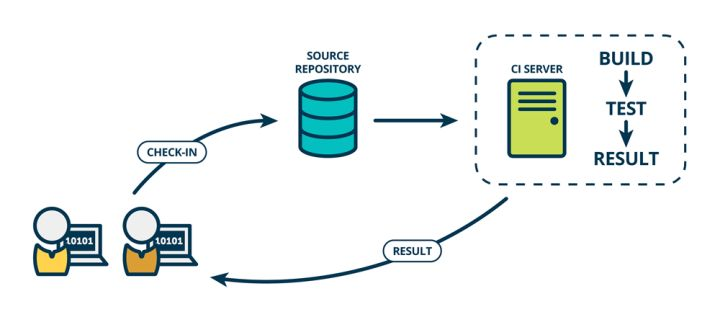
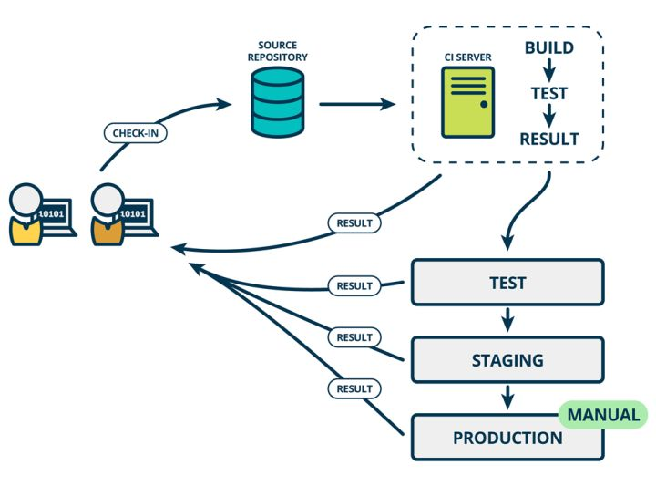
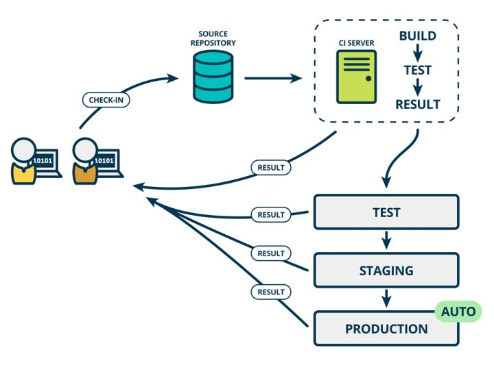

# 持续集成

持续集成指的是，频繁地（一天多次）将代码集成到主干。

持续集成强调开发人员提交了新代码之后，立刻进行构建、（单元）测试。根据测试结果，我们可以确定新代码和原有代码能否正确地集成在一起。

## 持续交付

**持续交付（Continuous delivery）指的是，频繁地将软件的新版本，交付给质量团队或者用户，以供评审。**

持续交付在持续集成的基础上，将集成后的代码部署到更贴近真实运行环境的「类生产环境」（*production-like environments*）中。比如，我们完成单元测试后，可以把代码部署到连接数据库的 Staging 环境中更多的测试。如果代码没有问题，可以继续手动部署到生产环境中。

## 持续部署

**持续部署（continuous deployment）是持续交付的下一步，指的是代码通过评审以后，自动部署到生产环境。**

持续部署则是在持续交付的基础上，把部署到生产环境的过程自动化。