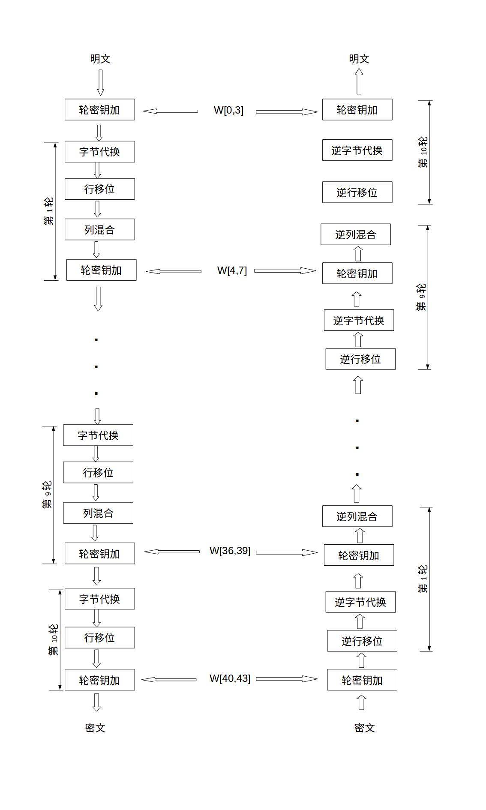
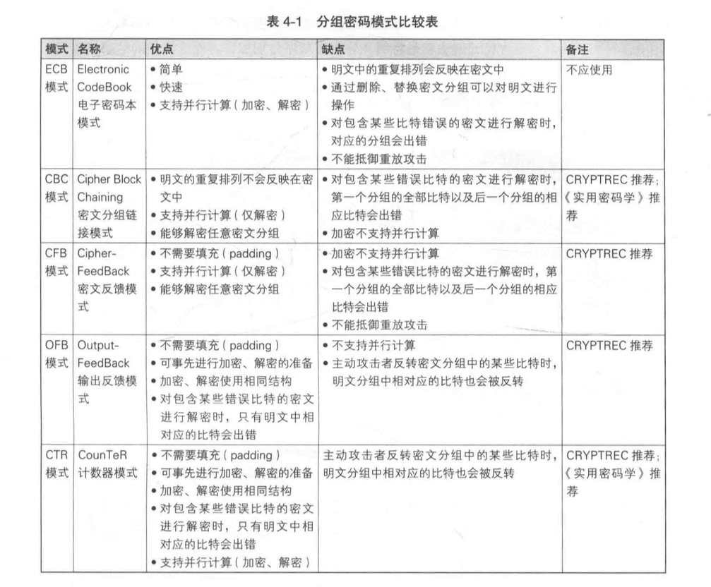

## 什么是 AES？

高级加密标准是一种用于加密电子数据的规范。该规范由美国国家标准与技术研究院 (NIST) 于 2001 年制定，美国政府和世界上的其他国家/地区已采用该规范来保护机密数据和信息。

## 为什么用AES？

- 简单: 对称加密算法
- 安全: 比 3DES 等其他对称算法更安全
- 快速: 在相同安全性下比其他算法速度更快
- 二进制: 支持二进制加密,也同时支持文本

- **加密模式**: ECB,CBC,CFB,OFB,CTR,XTS...
- **密钥长度**: 128, 256
- **iv向量**: 需要与密钥同时设置
- **padding**: NoPadding,ZeroPadding,PKCS5Padding,ISO10126Padding,ANSI X.923,SSL3Padding...
- **密钥**: 用于加解密的key

| AES     | 密钥长度（32位比特字) | 分组长度(32位比特字) | 加密轮数 |
| ------- | --------------------- | -------------------- | -------- |
| AES-128 | 4                     | 4                    | 10       |
| AES-192 | 6                     | 4                    | 12       |
| AES-256 | 8                     | 4                    | 14       |

## 处理Padding问题

| 算法/模式/填充           | 16字节加密后数据长度 | 不满16字节加密后长度 |
| ------------------------ | -------------------- | -------------------- |
| AES/CBC/NoPadding        | 16                   | 不支持               |
| AES/CBC/PKCS5Padding     | 32                   | 16                   |
| AES/CBC/ISO10126Padding  | 32                   | 16                   |
| AES/CFB/NoPadding        | 16                   | 原始数据长度         |
| AES/CFB/PKCS5Padding     | 32                   | 16                   |
| AES/CFB/ISO10126Padding  | 32                   | 16                   |
| AES/ECB/NoPadding        | 16                   | 不支持               |
| AES/ECB/PKCS5Padding     | 32                   | 16                   |
| AES/ECB/ISO10126Padding  | 32                   | 16                   |
| AES/OFB/NoPadding        | 16                   | 原始数据长度         |
| AES/OFB/PKCS5Padding     | 32                   | 16                   |
| AES/OFB/ISO10126Padding  | 32                   | 16                   |
| AES/PCBC/NoPadding       | 16                   | 不支持               |
| AES/PCBC/PKCS5Padding    | 32                   | 16                   |
| AES/PCBC/ISO10126Padding | 32                   | 16                   |

## 加密操作流程

## 分组密码模式对比:

#### 

## 更多资料

https://halfrost.com/symmetric_encryption/