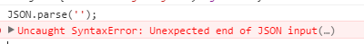
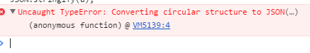

## 简介

JSON：JavaScript 对象表示法

JSON 是存储和交换文本信息的语法。类似 XML。

JSON 比 XML 更小、更快，更易解析。

JSON的媒体类型被定义为 application/json，而文件的后缀为.json。


## 应用

### JSON的应用

1、接口

2、微信开发


### XML的应用

1、我们一般用于sitemap较多

2、xmlrpc是使用http协议做为传输协议的rpc机制，使用xml文本的方式传输命令和数据。

备注：json和XML可以互转


## JavaScript的应用

### 一、JSON - 转换为 JavaScript 对象

1、能够使用内建的 JavaScript eval(string)方法进行解析

原因：JSON 文本格式在语法上与创建 JavaScript 对象的代码相同。

由于这种相似性，无需解析器，JavaScript 程序能够使用内建的 eval() 函数，用 JSON 数据来生成原生的 JavaScript 对象。


ajax返回的是字符串，而不是json对象。

data = eval('('+data+')');


### 二、实例

```
var JSONObject= 
  { 
    "name":"Bill Gates", "street":"Fifth Avenue New York 666", "age":56, "phone":"555 1234567"
  };
  
  JSONObject.name //调用
```


### 三、语法规则

- 数据在名称/值对中

- 数据由逗号分隔

- 花括号保存对象

- 方括号保存数组

值/对象/数组


### 四、方法

1、JSON.parse()

parse用于从一个字符串中解析出json对象


例子：

var str = '{"name":"huangxiaojian","age":"23"}'

结果：

JSON.parse(str)

Object

1. age: "23"

2. name: "huangxiaojian"

3. __proto__: Object


2、JSON.stringify()

stringify()用于从一个对象解析出字符串


例子：

var  a = {a:1,b:2}

结果：

JSON.stringify(a)

"{"a":1,"b":2}"


### 五、错误提示

1、



data不是正确的json格式，造成解析出错

2、


- var a=JSON.parse('{"a":"aaaaa"}');//正确 

- var a=JSON.parse("{'a':'aaaaa'}");//错误 


3、 [Uncaught TypeError: Cannot use 'in' operator to search for '' in JSON string](http://stackoverflow.com/questions/23673184/uncaught-typeerror-cannot-use-in-operator-to-search-for-in-json-string)

解决方案：JSON字符串转换为JavaScript对象。

要修复它，通过标准JSON.parse()或jQuery 的 $.parseJSON 将其转换为JavaScript对象。

4、



var a = { };

var b = { a: a };

a.b = b;

JSON.stringify(a);


参考：https://segmentfault.com/a/1190000002532027


## php中的json

### 一、注意点

1、json_last_error：返回最后发生的错误

2、json_decode 当第二个参数为 TRUE 时，将返回 array 而非 object 。 

3、由于json只接受utf-8编码的字符，所以json_encode()的参数必须是utf-8编码，否则会得到空字符或者null。


4、PHP支持两种数组，一种是只保存"值"（value）的索引数组（indexed array），另一种是保存"名值对"（name/value）的关联数组（associative array）。

由于javascript不支持关联数组，所以json_encode()只将索引数组（indexed array）转为数组格式，而将关联数组（associative array）转为对象格式。

- $arr = array('one', 'two', 'three');

- echo json_encode($arr);  //["one","two","three"] 

- $arr = array('1'=>'one', '2'=>'two', '3'=>'three'); 

- echo json_encode($arr);  // {"1":"one","2":"two","3":"three"}

- 数据格式从"[]"（数组）变成了"{}"（对象）。

- 如果你需要将"索引数组"强制转化成"对象"，可以这样写

- echo json_encode(（object）$arr);  

- echo json_encode($arr,JSON_FORCE_OBJECT  )


5、类的转换

- <?php

- class Foo {

- ​        const     ERROR_CODE = '404';

- ​        public    $public_ex = 'this is public';

- ​        private   $private_ex = 'this is private!';

- ​        protected $protected_ex = 'this should be protected'; 

- ​        public function getErrorCode() {

- ​                return self::ERROR_CODE;

- ​        }

- }

- $foo = new Foo;

- $foo_json = json_encode($foo);

- echo $foo_json;

- ?>

- 

1. ​    {     

1. ​      "public_ex": "this is public" 

1. ​     }

除了公开变量（public），其他东西（常量、私有变量、方法等等）都遗失了。


### 二、错误

$json = "{ 'bar': 'baz' }"; 　　 　　//分割符只能用单引号　　

$json = '{ bar: "baz" }'; 　　 　　　　

$json = '{ "bar": "baz", }';


### 三、中文编码的问题

1、

- ​    function getJson($data){

- ​        if(version_compare('5.4',PHP_VERSION,'<')){

- ​            //5.4以上

- ​            return json_encode($data,JSON_UNESCAPED_UNICODE);

- ​        }else{

- ​            return urldecode(json_encode(url_encode($data)));

- ​        }

- ​    }

- 

- 数据存的json格式，如果数据库存的是array

- eval("\$session= $str;");


### 四、json格式的问题

微信放的json解析不了：

去除反斜杠 StripSlashes


### 五、其他补充：

json的校验

一个文本文档或字符串必须遵守JSON的语法定义，才能被视作一个有效的JSON文档。

http://www.jsonlint.com/

补充：

用 JSON 构建 API 的标准指南中文版

http://jsonapi.org.cn/